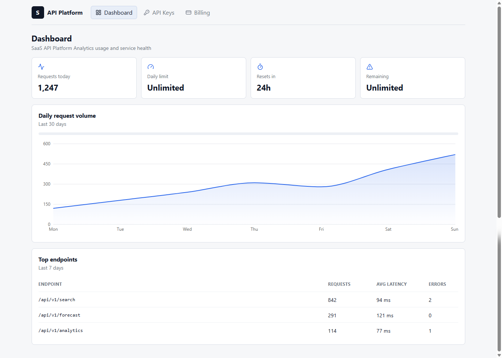
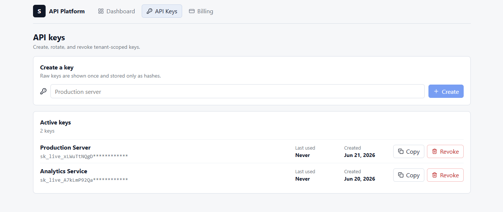
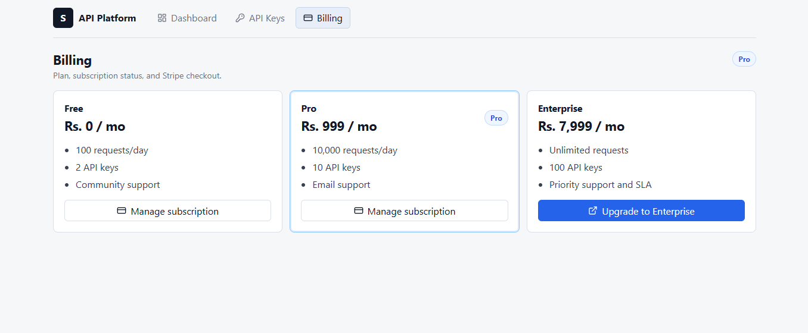
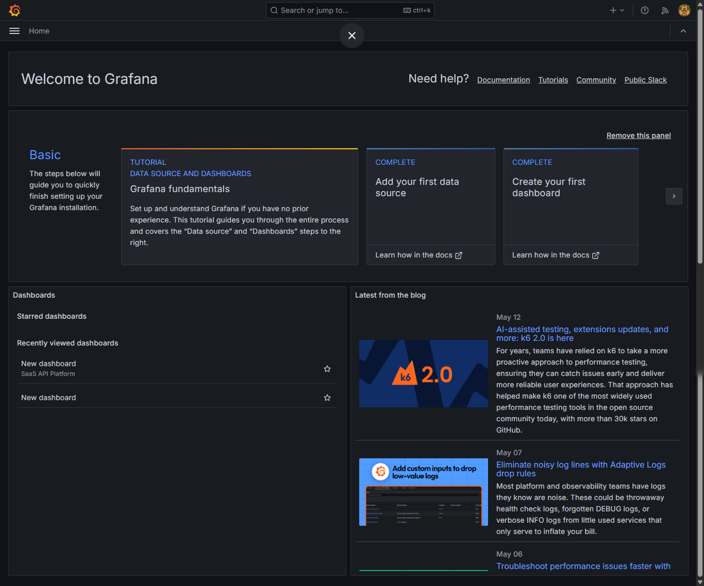
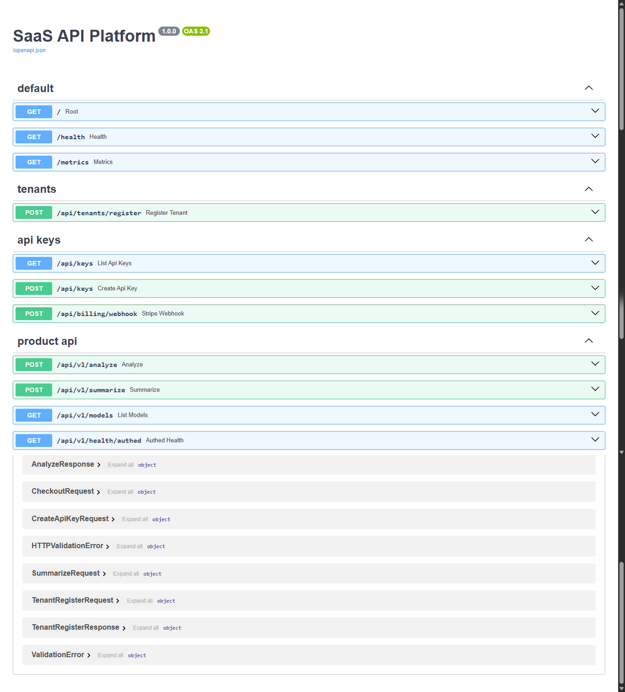

# 🚀 SaaS API Platform with Full Monetization Stack

A production-style, multi-tenant SaaS API Platform built using **FastAPI, PostgreSQL, Redis, React, Docker, Stripe, Prometheus, Grafana, and GitHub Actions**.

This platform demonstrates how modern SaaS businesses manage API authentication, tenant isolation, usage tracking, subscription billing, observability, and cloud-native deployment workflows.

---

## 🌟 Overview

The SaaS API Platform provides a complete foundation for building and monetizing APIs at scale.

It includes:

* Secure API Key Authentication
* Multi-Tenant SaaS Architecture
* Usage Analytics Dashboard
* Subscription Billing & Monetization
* Redis-Based Rate Limiting
* Stripe Integration
* Monitoring & Observability
* CI/CD Deployment Automation

The project is designed to simulate a real-world SaaS product and follows industry-standard backend, frontend, and DevOps practices.

---

## ✨ Features

## 🔐 Authentication & Security

* API Key Authentication
* HMAC-SHA256 Key Hashing
* Secure Key Storage
* Authorization Middleware
* Tenant Isolation
* PostgreSQL Row-Level Security (RLS)
* Secure API Access Control

## ⚡ API Platform Features

* Multi-Tenant Architecture
* API Key Lifecycle Management
* Usage Tracking
* Request Logging
* Rate Limiting with Redis
* Plan-Based Access Control
* Tenant Analytics

## 💳 Billing & Monetization

* Stripe Checkout Integration
* Stripe Customer Portal
* Subscription Plans
* Webhook Verification
* Billing Automation
* Free / Pro / Enterprise Plans

## 📊 Monitoring & Analytics

* Prometheus Metrics
* Grafana Dashboards
* API Latency Monitoring
* Error Tracking
* Endpoint Analytics
* Active Tenant Monitoring

## 🚀 DevOps & Deployment

* Dockerized Services
* Docker Compose Orchestration
* GitHub Actions CI/CD
* AWS ECR Container Registry
* AWS EC2 Deployment
* Nginx Reverse Proxy
* Automated Testing Pipeline

---

## 🏗 System Architecture

```text
                    ┌──────────────────┐
                    │  React Frontend  │
                    └────────┬─────────┘
                             │
                             ▼
                    ┌──────────────────┐
                    │      Nginx       │
                    └────────┬─────────┘
                             │
                             ▼
                    ┌──────────────────┐
                    │     FastAPI      │
                    └──────┬─────┬─────┘
                           │     │
                ┌──────────┘     └──────────┐
                ▼                           ▼
        ┌─────────────┐             ┌─────────────┐
        │    Redis    │             │ PostgreSQL  │
        └─────────────┘             └─────────────┘
                │
                ▼
         Rate Limiting Layer

 Prometheus ─────────────► Grafana

 Stripe Billing ─────────► Subscription Engine
```

---

## 🛠 Technology Stack

## Backend

* FastAPI
* SQLAlchemy
* PostgreSQL
* Redis
* Alembic
* Celery

## Frontend

* React
* Vite
* JavaScript
* CSS

## Billing

* Stripe Checkout
* Stripe Customer Portal
* Stripe Webhooks

## Monitoring

* Prometheus
* Grafana

## DevOps

* Docker
* Docker Compose
* GitHub Actions
* AWS EC2
* AWS ECR
* Nginx

---

## 📁 Project Structure

```text
saas-api-platform/
│
├── backend/
│   ├── app/
│   │   ├── api/
│   │   ├── auth/
│   │   ├── billing/
│   │   ├── db/
│   │   ├── monitoring/
│   │   ├── ratelimit/
│   │   └── usage/
│   │
│   ├── alembic/
│   └── tests/
│
├── frontend/
│   └── src/
│
├── grafana/
├── prometheus/
├── nginx/
│
├── .github/workflows/
│
├── docker-compose.yml
└── README.md
```

---

## ⚙️ Local Setup

## Clone Repository

```bash
git clone https://github.com/Ashishiqbalcse/saas-api-platform.git
cd saas-api-platform
```

## Configure Environment Variables

```bash
cp .env.example .env
```

Update all required environment variables.

## Start Services

```bash
docker compose up --build -d
```

## Run Database Migrations

```bash
docker compose exec backend alembic upgrade head
```

---

## 🧪 Testing

Run the complete test suite:

```bash
pytest -v
```

## Current Test Coverage

✅ API Key Authentication

✅ Security Middleware

✅ Rate Limiting

✅ Stripe Webhooks

✅ Health Checks

✅ Usage Tracking

✅ Billing Logic

---

## 📊 Monitoring

## Prometheus

```text
http://localhost:9090
```

Tracked Metrics:

* Request Count
* Request Latency
* Error Rate
* Active Tenants
* Rate Limit Hits

## Grafana

```text
http://localhost:3001
```

Default Credentials:

```text
Username: admin
Password: changeme
```

Dashboard Metrics:

* P50 Latency
* P95 Latency
* Error Rate
* API Usage
* Endpoint Analytics
* Tenant Activity

---

## 🔌 API Endpoints

## Public Endpoints

| Method | Endpoint              | Description        |
| ------ | --------------------- | ------------------ |
| GET    | /health               | Health Check       |
| GET    | /metrics              | Prometheus Metrics |
| POST   | /api/tenants/register | Register Tenant    |
| POST   | /api/billing/webhook  | Stripe Webhook     |

## Protected Endpoints

| Method | Endpoint              |
| ------ | --------------------- |
| GET    | /api/v1/health/authed |
| POST   | /api/v1/analyze       |
| POST   | /api/v1/summarize     |
| GET    | /api/v1/models        |
| GET    | /api/keys             |
| POST   | /api/keys             |
| DELETE | /api/keys/{id}        |
| GET    | /api/usage/summary    |
| GET    | /api/usage/daily      |
| GET    | /api/usage/endpoints  |

---

## 💳 Subscription Plans

| Plan       | Daily Requests | API Keys | Support      |
| ---------- | -------------- | -------- | ------------ |
| Free       | 100            | 2        | Community    |
| Pro        | 10,000         | 10       | Email        |
| Enterprise | Unlimited      | 100      | Priority SLA |

---

## 🚀 Deployment Pipeline

Required GitHub Secrets:

```text
AWS_ACCESS_KEY_ID
AWS_SECRET_ACCESS_KEY
ECR_REGISTRY
EC2_HOST
EC2_SSH_KEY
PRODUCTION_API_URL
```

Deployment Flow:

```text
Git Push
   ↓
GitHub Actions
   ↓
Run Tests
   ↓
Build Docker Images
   ↓
Push to AWS ECR
   ↓
Deploy to EC2
   ↓
Rolling Update via Nginx
```

---

## 📸 Screenshots

## Dashboard



## API Key Management



## Billing Dashboard



## Grafana Monitoring



## Swagger API Documentation



---

## 🎯 Learning Outcomes

This project demonstrates practical experience with:

* SaaS Product Architecture
* Backend API Development
* Database Design
* Authentication & Security
* Subscription Billing
* Monitoring & Observability
* Cloud Deployment
* DevOps Automation
* Multi-Tenant Systems

---

## 👨‍💻 Author

Ashish Iqbal

B.Tech Computer Science & Engineering (2022–2026)

Assam Kaziranga University

GitHub: [https://github.com/Ashishiqbalcse]

---

## ⭐ Highlights

✅ Multi-Tenant SaaS Architecture

✅ FastAPI Backend

✅ React Developer Dashboard

✅ PostgreSQL + Redis

✅ Stripe Billing Integration

✅ API Key Authentication

✅ Usage Analytics

✅ Prometheus & Grafana Monitoring

✅ Dockerized Infrastructure

✅ CI/CD Automation

✅ Cloud Deployment Ready
